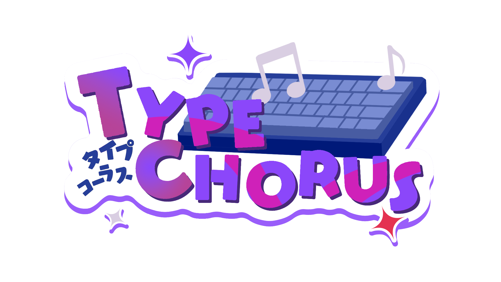
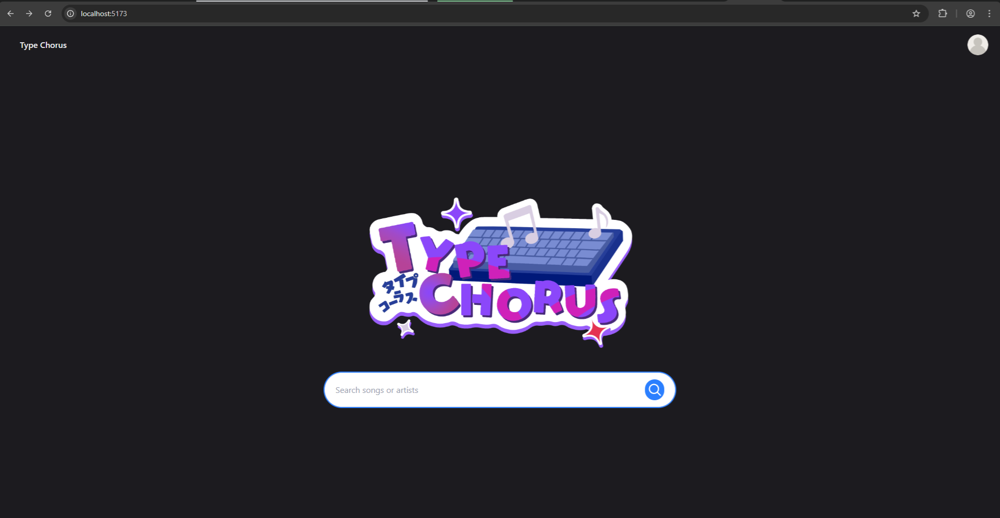
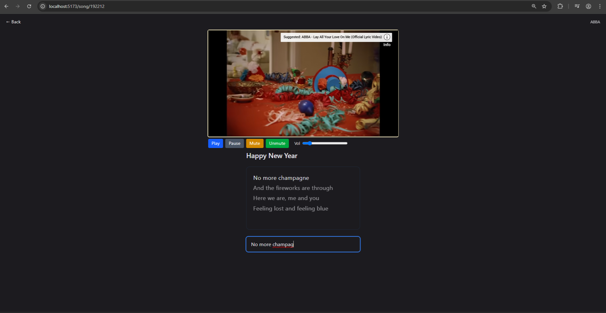
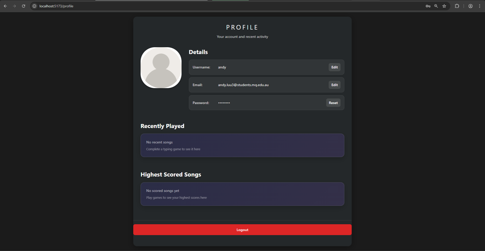

<p align="center">
	
</p>

<h1 align="center">🎹 TypeChorus 🎶</h1>

<p align="center">
  <em>A chat-style rhythm typing game built for a university group project!</em>
</p>

---

 Well... TypeChorus is a web game that is a typing rhythm game made as a group project for a unit in Uni. Even though 99% of the code was contributed by me with AI and my team contributed absolutely nothing... here we are! A kinda functional game lol.

## ✨ Features

- 🎵 **Rhythm Gameplay:** Real-time lyric progression synced with YouTube videos.
- ⌨️ **Typing Mechanics:** Typing-based scoring, streaks, and hit tracking.
- 🔍 **Music Search:** YouTube-powered song lookup and playback.
- 👤 **Player Profiles:** User authentication, profiles, and flow.
- 🚀 **Modern Stack:** Smooth and scalable React frontend + Express backend.

## 📸 Gallery

| 🏠 Home | 🎮 Gameplay | 👤 Profile |
| :---: | :---: | :---: |
|  |  |  |

<details>
<summary>📂 <strong>Project Structure (Click to expand)</strong></summary>

```text
group-project-type-chorus/
├── typefront/   # React + TypeScript + Vite client
├── typeback/    # Express API + auth + YouTube search
└── screenshots/ # Project screenshots
```
</details>

## 🛠️ Tech Stack

### Frontend
- **Framework:** React, React Router
- **Language:** TypeScript
- **Tooling:** Vite

### Backend
- **Framework:** Node.js, Express
- **Database:** MongoDB, Mongoose
- **Auth:** JWT + bcrypt
- **APIs:** YouTube Search Proxy, LRCLIB (for lyrics)

## 🚀 Local Setup

### 1️⃣ Backend (`/typeback`)

```powershell
cd typeback
Copy-Item env.example .env
npm install
npm run dev
```

> **Default Port:** `http://localhost:3000`

**Required Environment Variables (`.env`):**
```env
PORT=3000
FRONTEND_ORIGIN=http://localhost:5173
JWT_SECRET=change-me-in-production
JWT_TTL=7d
MONGODB_URI=mongodb+srv://<username>:<password>@<cluster-host>/typechorus?retryWrites=true&w=majority&appName=typechorus
```

### 2️⃣ Frontend (`/typefront`)

```powershell
cd typefront
Copy-Item env.example .env
npm install
npm run dev
```

> **Default Port:** `http://localhost:5173`

**Required Environment Variables (`.env`):**
```env
VITE_API_BASE=http://127.0.0.1:3000
VITE_APP_NAME=TypeChorus
VITE_APP_VERSION=dev
```

## 📜 Available Scripts

| Environment | Command | Description |
| ----------- | ------- | ----------- |
| **Backend** | `npm run dev` | Start backend with nodemon |
|             | `npm start` | Start backend with node normally |
| **Frontend** | `npm run dev` | Start Vite dev server |
|             | `npm run build` | Type-check and build production assets |
|             | `npm run preview` | Preview production build locally |
|             | `npm run lint` | Run ESLint checks |

## 🕹️ Core Flow

1. **Search** a track from the Home screen.
2. **Load** the requested YouTube video & synchronized lyric timing data.
3. **Type** lyrics precisely as they appear and sync with playback.
4. **Build** your score and maintain a streak across lines.
5. **Save** your progress dynamically via authenticated profile flows.

## ⚠️ Important Notes

- **CORS Setup:** Keep backend `FRONTEND_ORIGIN` aligned with your frontend URL to avoid cross-origin errors!
- **API Matching:** Keep frontend `VITE_API_BASE` aligned with your backend port.
- **Autoplay Policies:** Browser autoplay restrictions may require clicking the screen once before full media playback starts.

---

<p align="center">
  <em>️I HATE MY TEAMATES</em>
</p>
